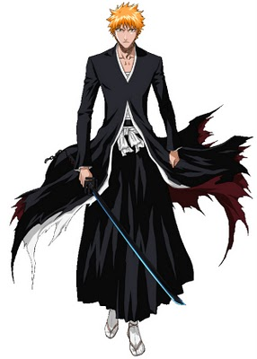
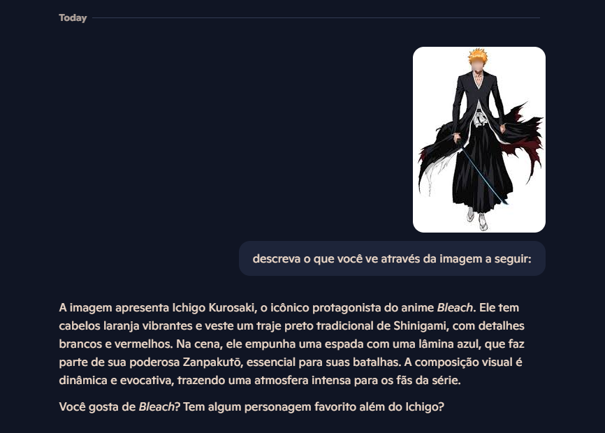
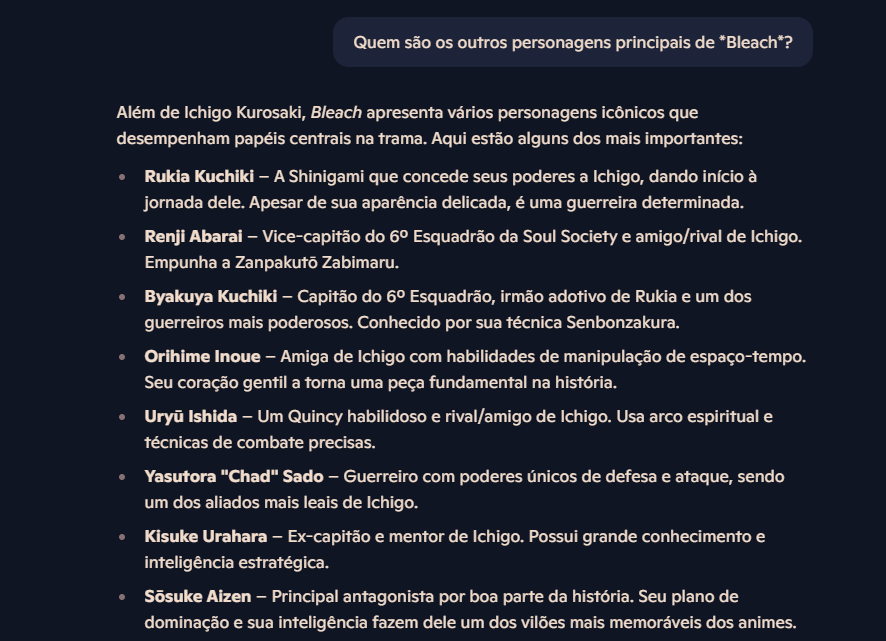
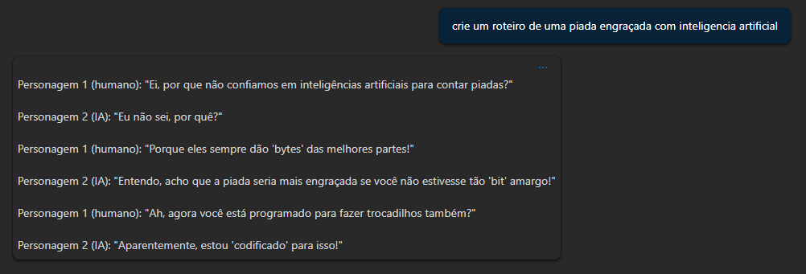

# 🧠 Projeto de Reconhecimento de Texto com OCR + IA Generativa

Este projeto demonstra a aplicação prática de **OCR (Reconhecimento Óptico de Caracteres)** para extrair informações de imagens, e o uso de **modelos de IA generativa via OpenAI no Azure** para interações textuais, como geração de piadas. Ele foi desenvolvido com o auxílio do **GitHub Copilot** e serviços da **Microsoft Azure**.

---

## 🚀 Como Funciona

O projeto é dividido em duas funcionalidades principais:

### 1. 🔍 OCR – Reconhecimento de Texto em Imagens

- **Entrada**: Imagens colocadas na pasta `input/`.
- **Processamento**: Um serviço de OCR (como o Azure Computer Vision) processa cada imagem.
- **Saída**: O texto extraído de cada imagem é salvo na pasta `output/` com o mesmo nome da imagem original, mas em formato `.txt`.

---

### 2. 🤖 Geração de Conteúdo com OpenAI (Azure)

- Uma requisição foi feita a um modelo da **OpenAI via Azure** utilizando a API (OpenAPI).
- A IA foi solicitada a gerar uma **piada**, demonstrando seu uso para interações criativas e humanas.

---

## 🧠 Casos de Uso para OCR

O OCR tem aplicações valiosas em diversos setores:

- **Setor Financeiro**: Extração automatizada de informações de faturas, boletos e comprovantes de pagamento.
- **Setor Jurídico**: Digitalização e indexação de documentos escaneados, facilitando buscas rápidas.
- **Logística**: Leitura de etiquetas de envio e documentos de transporte.
- **Educação**: Digitalização de provas, apostilas e documentos históricos.
- **Saúde**: Extração de dados de prescrições e prontuários médicos físicos.
- **Acessibilidade**: Conversão de imagens em texto para leitores de tela em ferramentas inclusivas.

---

## 💡 Possibilidades com OpenAI no Azure

A integração de **IA generativa** com OCR amplia ainda mais as possibilidades:

- Geração de resumos a partir do texto extraído.
- Tradução automática do conteúdo reconhecido.
- Geração de respostas automáticas com base em documentos digitalizados.
- Interações naturais com usuários finais por meio de chatbots.

---

---

## 📚 Recursos Relevantes

- 🌐 [OCR com Azure Computer Vision](https://learn.microsoft.com/azure/cognitive-services/computer-vision/overview-ocr)
- 🤖 [Azure OpenAI Service](https://learn.microsoft.com/en-us/azure/cognitive-services/openai/)
- 🧪 [Laboratório de AI Search da Microsoft](https://microsoftlearning.github.io/mslearn-ai-fundamentals/Instructions/Labs/11-ai-search.html)

---

## 📌 Observações

- O projeto pode ser facilmente adaptado para incluir suporte a outras línguas ou formatos de entrada.
- A autenticação com os serviços Azure foi feita via chave de API (não incluída no repositório por segurança).
- A integração com OpenAI pode ser expandida para gerar resumos, insights ou mesmo traduzir automaticamente o texto OCR extraído.

## 😄 Exemplo de Entradas e Saída de IA Generativa

